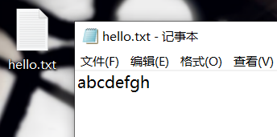

#文件IO

`using System.IO`

Stream:流式IO

* `FileStream`： 字节为单位的文件操作类
* `MemoryStream`：字节为单位的内存操作类
* `NetWorkStream`：字节为单位的网络类
* `StreamReader`：读取文本文件的类
* `StreamWrite`：写入文本文件的类


##FileStream

###构造函数

`FileStream(文件路径,FileMode,FileAccess)`

* FileMode：文件操作模式，枚举类型
* FileAccess：访问模式：也是枚举读写

##方法

* ReadByte()：读取一个字节，返回int，没有返回-1
* Read(byte[] bs, 数组开始位置, 读取字节个数)：指定字节个数到数组中，返回int，没读到返回0
* WriteByte(byte)：写入一个字节，无返回值
* Write(byte[] bs,数组开始位置, 输出数组中元素个数)：写入多个字符，无返回

写文件
```
static void Main(string[] args)
        {
            //如果一个类操作了一个对象，而这个对象非CLR托管，在执行完后就要释放
            //如hello.txt显然不是由CLR托管，所以要调用Clear和Dispose释放

            //https://blog.csdn.net/lidandan2016/article/details/77868043
            using (FileStream streamWrite = new FileStream(@"C:\Users\Asuhi\Desktop\hello.txt", 
                //@取消转义语义
                FileMode.Create, 
                FileAccess.Write))
            {
                //使用GetEncoding得到编码或直接使用对象
                //byte[] bs = Encoding.GetEncoding("GB2312").GetBytes("abcdefgh");
                byte[] bs = Encoding.UTF8.GetBytes("abcdefgh");
                streamWrite.Write(bs, 0, bs.Length);
            }

            //直接写下面两个太麻烦，使用using()把对象创建过程包裹起来，在执行完花括号里面的内容后自动调用
            //下面两个函数    
            //streamWrite.Close();//关闭
            //streamWrite.Dispose();//释放
            Console.ReadLine();
        }
```

运行结果



读取
```
static void Main(string[] args)
        {
            using (FileStream streamRead = new FileStream(@"C:\Users\Asuhi\Desktop\hello.txt", 
                //@取消转义语义
                FileMode.Open, 
                FileAccess.Read))
            {
                byte[] bs = new byte[1024];
                int len = streamRead.Read(bs, 0, 1024);
                while(len > 0)
                {
                    string str = Encoding.UTF8.GetString(bs,0,len);
                    Console.WriteLine(str);//abcdefgh

                    len = streamRead.Read(bs, 0, 1024);
                }
            }
            Console.ReadLine();
        }
```
