##Whitted-style Ray Trancing 

从人眼(点)开始发出一条射线，和场景中的物体发生多次折射和反射得到多个点。
然后将这些点与光源进行连线，如果可见则将这个点的颜色进行叠加后写回该像素中去。

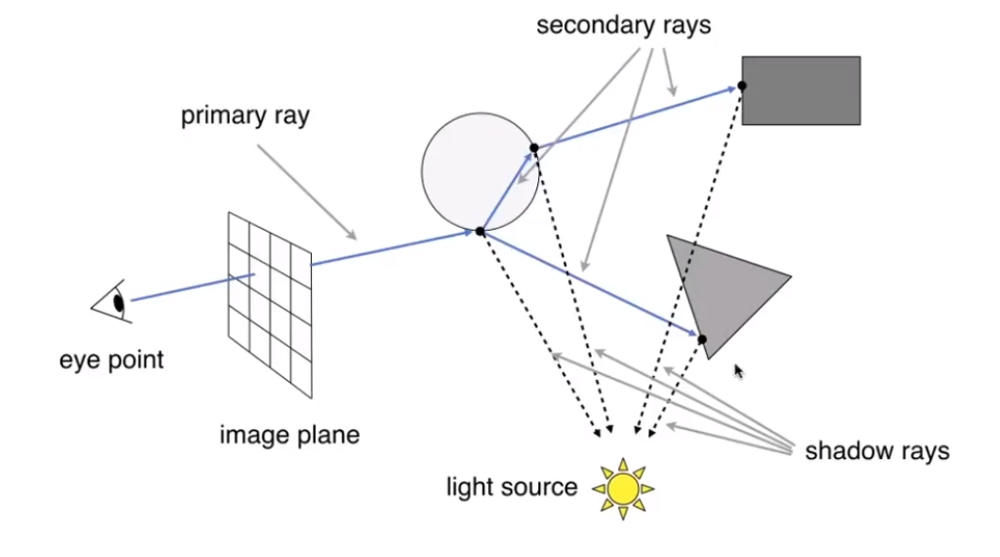

###**1，求光线与物体的交点**

光源的位置是 **0** 
方向单位向量是**d**

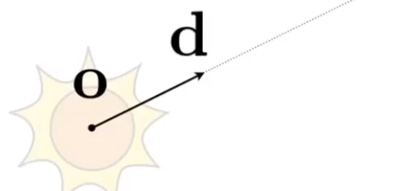

那么光线表示为：

    

1 光线与隐试表面求交点

2 光线和三角形求交点

> 步骤： 先判断光线是否在三角形所在的平面有交点，在判断这个交点是否在三角形内。

定义平面需要：平面的法线 N 和平面内任意点P   定义平面的函数： `ax + by + cz + d= 0`
	
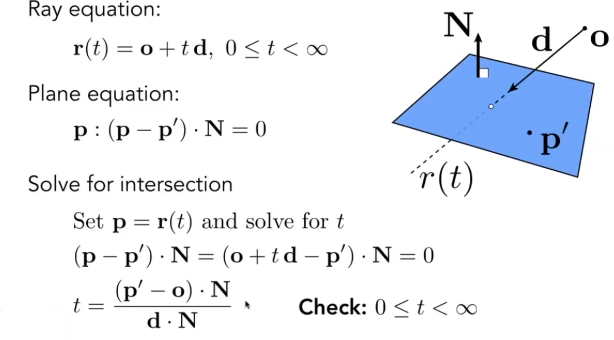

简单算法：对于重心坐标来说，当b1 b2 和（1-b1-b2）是正的就表示点在三角形内

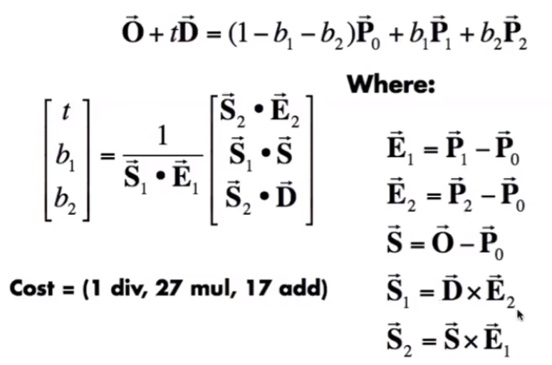

由于物体本身有很多个三角形，如果光线与每个三角形求交点的话速度非常缓慢：

> `Navie algorithm = #pixel * #objects  (* #bounces)`  -->  像素 * 三角形数 * 弹射次数

###**包围盒**

> 逻辑1  如果某个光线碰不到包围盒，那就不可能碰到包围盒里面的物体
> 逻辑2 包围盒只考虑3个相对的面
> 逻辑3 光线必须进入了3个相对的面 那么光线一定穿过了盒子，如果光线离开任意一个对面那么光线没有穿过盒子

示意图:

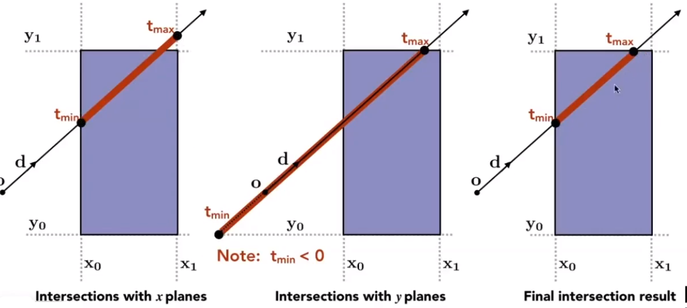

光线与三组相对的面 会有6个交点。那么`t enter = max{tmin} t exit = min{tmax}`
意思是光线对每组平面求交点(t可能为负) 那么我们对所有进入的时间t求最大值，对所有出去的时间t求最小值
如果 `t enter  < t exit ` 表示光线在这段时间△t内在盒子里面
显然光线是射线不是直线
如果 `texit < 0` 说明这个盒子在光线背后
如果 `texit < 0  &&  tenter >= 0 `说明  光线的起点在盒子里面 肯定有交点!
如果 `tenter < texit && texit > 0 `说明有交点

##使用AABB包围盒简化RayTrancing

> 思路 将场景分为若干个格子(Grid) 再把有物体的格子标记出来 光线进入场景后先判断与格子是否有交点。
> 如果这个有交点的格子内有物体，那么就与这个格子内的物体求交点。

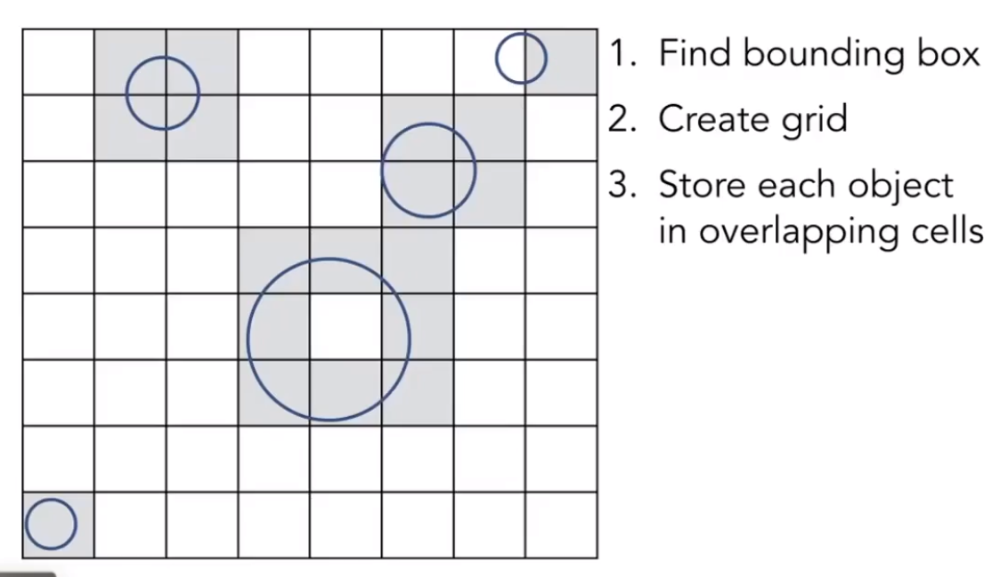

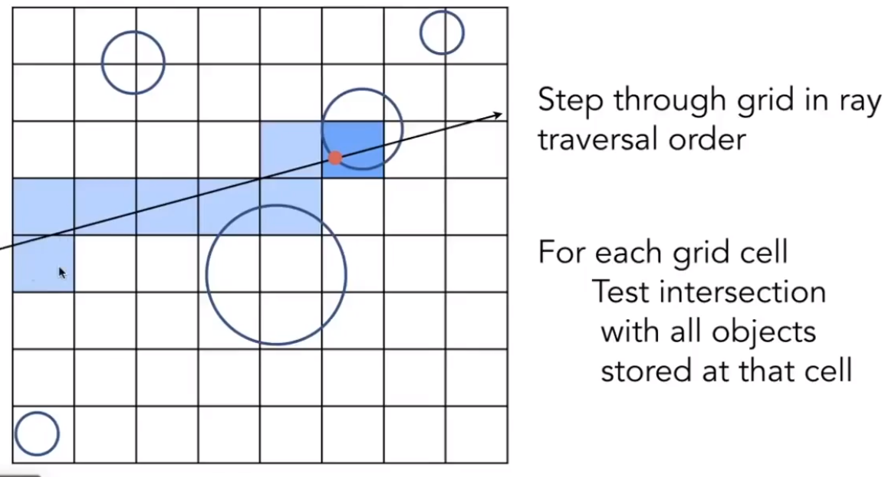

###如何正确定义格子的数量

`#cells = C * #objs`
格子数量 = C * 物体数量
C是常数在3D场景中的值 ≈ 27

> 存在的问题：场景中物体的数量不均匀

####空间划分(Spatial Partitions)

**KD-tree**

求交点步骤：
1. 先建立好KD-Tree
2. 先判断光线是否与A有交点，如果有则继续判断是否与1和B有交点
3. 如果发现1是叶子结点，那么就与1里面的物体求交点
4. 如果发现B还要叶子结点，那么就与B的子节点2和C判断交点
5. 重复这个过程，找到3区域的hit点。

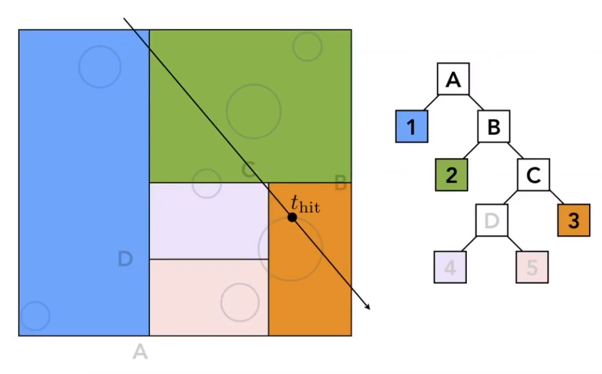

KD-Tree 的问题：很难判断三角形是否在某个格子里，多个格子划分同一个三角形会比较复杂

**BVH(Bounding Volume Hierarchy)**

按照物体来求包围盒。
1. 先将物体划分成两部分，分别计算两部分的包围盒
2. 在继续细分包围盒

这样的好处是保证某个物体只在一个包围盒里面而不是像KD那样切割某个物体

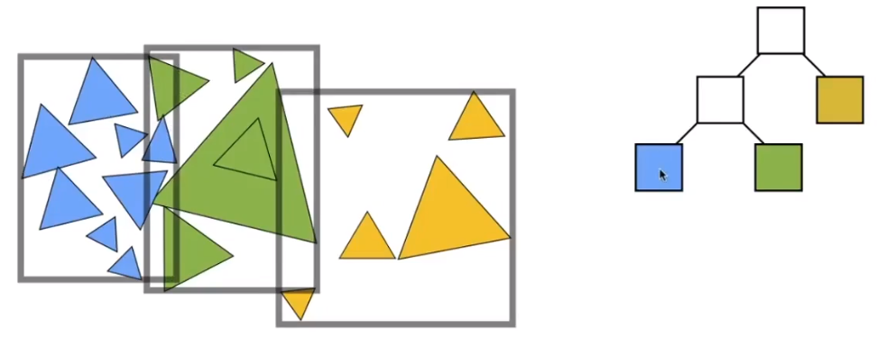

均匀划分：（让树接近平衡）
1. 每次划分结点时，按照那个包围盒最长的那个轴进行切割
2. 选取物体时选择中间的那个三角形，保证分成两部分后这两部分三角形的数量差不多（选取中位数--快速选择算法）

##基础辐射度量学（Basic radiometry）

> 动机：BlinnPhong中并没有定义光源的物理量。在Whitted光追中如何考虑光发生折射反射后的衰减量？
> 如何准确定义光照？

先定义几个概念

**Radiant Enegry** ： 电磁辐射的能量 Q（单位焦耳 —— J）

**Radiant Flux(Power)** ：单位时间的能量  Φ = dQ/dt （单位是功率 瓦特 —— W）(光通量 流明 lm —— lumen)
什么是Flux ：假设有一个物体在向外辐射能量，这时在距离这个灯泡的某个范围内设定一个平面，物体辐射出来穿过单位平面的能量。

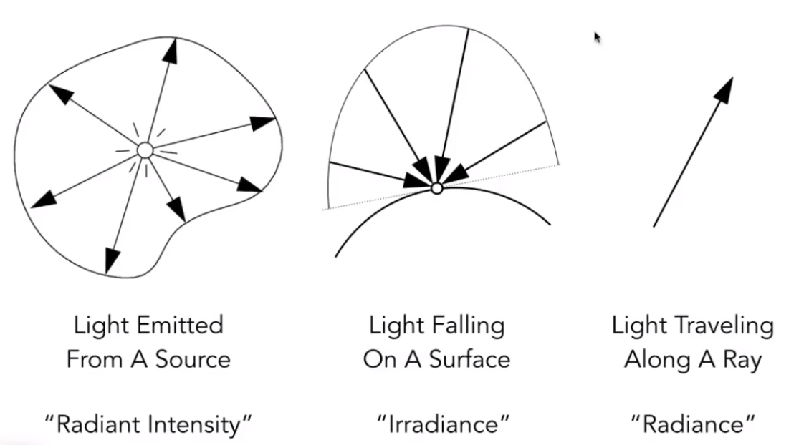

**Radiant Intensity** ：Power per unit **solid angle**(立体角)  
 I(ω) ≡ d(Φ) / d(ω) （单位是W/sr 或 lm/sr = candela） 
 也就是每一个单位立体角上的能量(power)

弧度定义角：θ = l / r        360° = 2π

在三维空间中从球心出发，形成一个锥形，对应会有一个球表面积
立体角定义为：面积A除以半径平方 

一个球的立体角为 4π

dA = (rdθ)(rsinθdΦ) = r²sinθdθdΦ
所以单位角公式为 dω = sinθdθdΦ
对于一个球来说 ：Ω = 4π

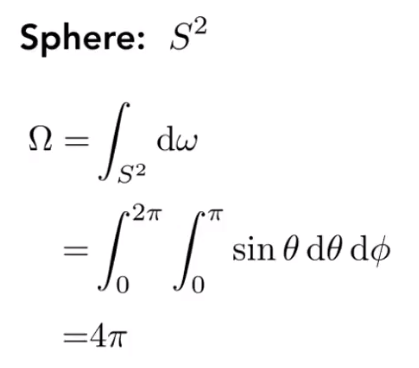 

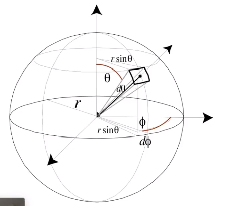

**Irradiance**  
**Radiance** 
表示 ：
光源辐射出的能量（具有方向性） 
任何一个物体表面接收的能量
光线传播时如何度量

我们 将所以方向上的**Irradiance**  求积分就能得到 Power  对于**Radiant Intensity** I = Φ/4π

###Irradiance定义
每一个微分面积上的光线的能量

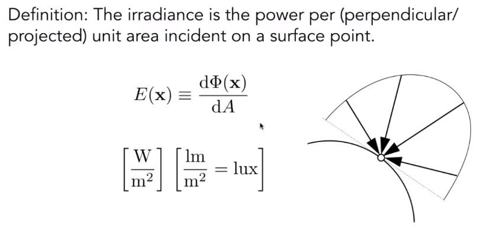

###Radiance定义

每单位立体角每单位面积删高地能量

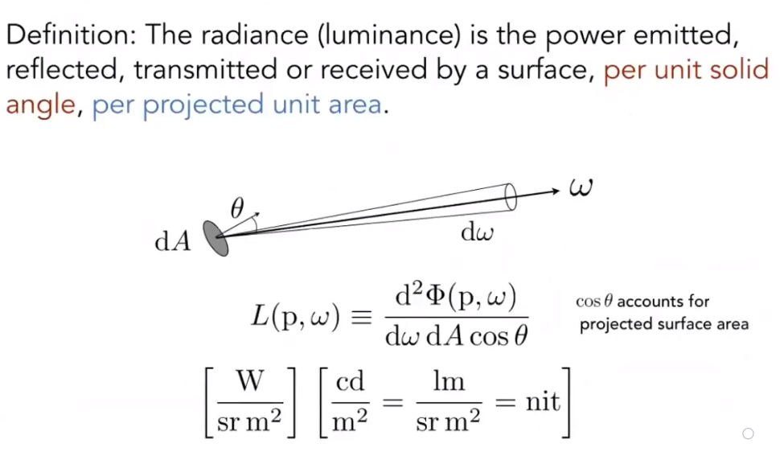

###总结定义

> 对于平面的一点p 他接受到的能量为 E(p)

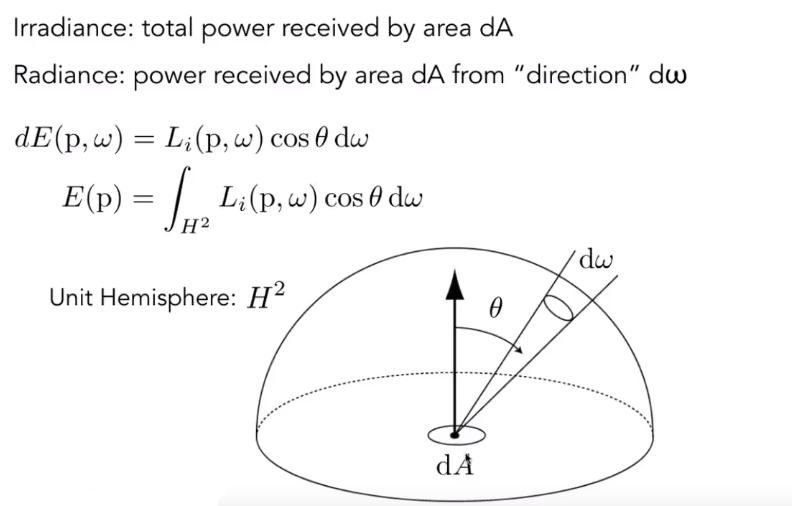

##BRDF(双向反射分布函数)

> 定义:BRDF告诉我们有多少能量从某个方向进来，他会往不同的反射方向上分布多少能量。 反射过程可以分解成两个过程。
> 1 对于一个点 从ω方向进来被该点的物体吸收。
> 2 吸收之后将这部分能量沿着另一个方向发射出去。

也就是说：物体是会反射能量的，但它由于某些原因导致它在各个角度上的反射的能量不同。BRDF就是来描述这个反射分布的函数。

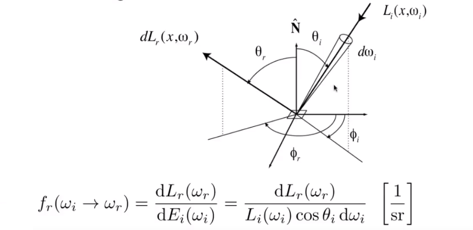

***BRDF这个项定义了不同的材质***

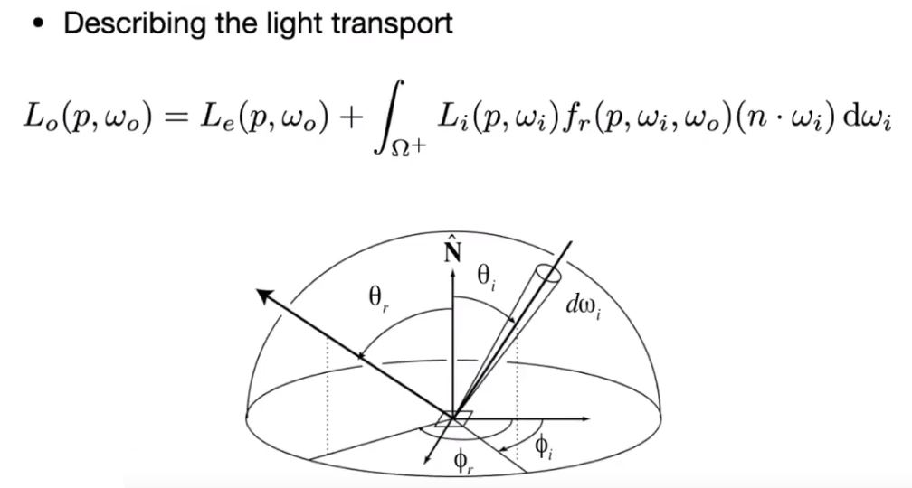

##路径追踪

###概率密度函数 

> X~p(x) 满足的条件 ：x >= 0 并且 对整个函数求积分结果为1   (PDF)

###蒙特卡洛积分：
对于一个复杂的函数我们很难求出它的定积分

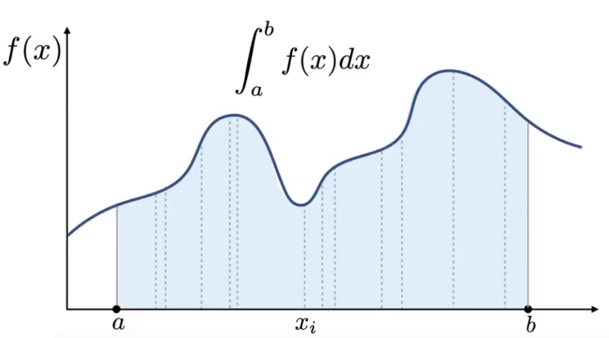

对于一个函数 f(x)我们求它的积分可以随机取一个xi的值f(xi)
我们把这个f(xi)当做整个积分那么结果是 (b - a) * f(xi)
如果我们采样的次数够多x1 x2 .... xn每一次都能得到一个面积
我们对这n次采样求平均值那么我们就能得到这个函数的积分了

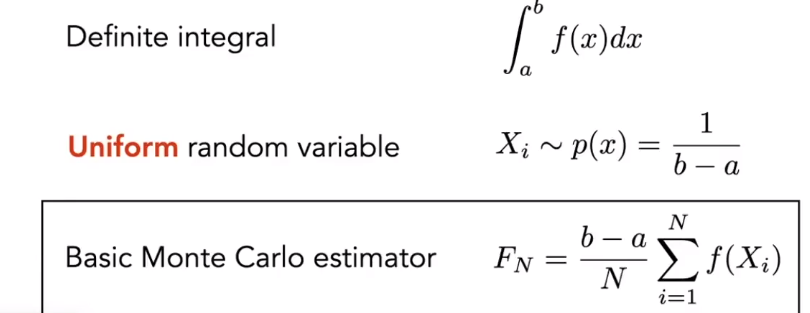

###使用蒙特卡洛积分解渲染方程

对于半球它的PDF 为 1/2π

所以如图所示

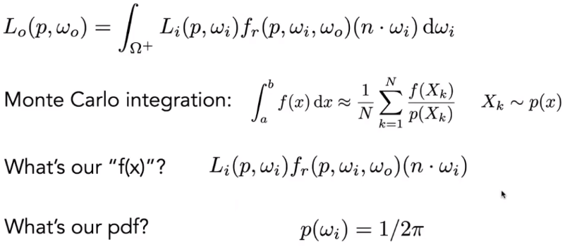

那么我们可以得到如下伪代码

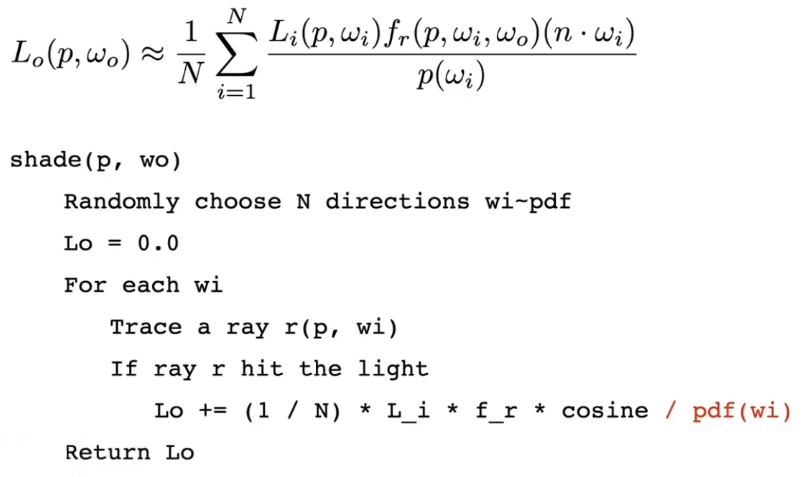

对于如下图所示计算Viewpoint的着色
我们需要知道光源直接到P进过BRDF后的颜色
而且还有知道Q点到P点经过BRDF后的颜色

那么我们将过程分为两个步骤
1 算出直接光照的着色值
2 求Q到P的光线值

要求2 的话我们可以递归，假设我们的Viewpoint在P->Q这个向量，那么我们要求的就是Q点受到的直接光照的值了。

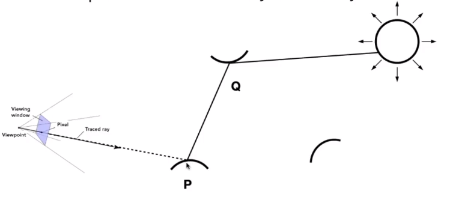

伪代码如图

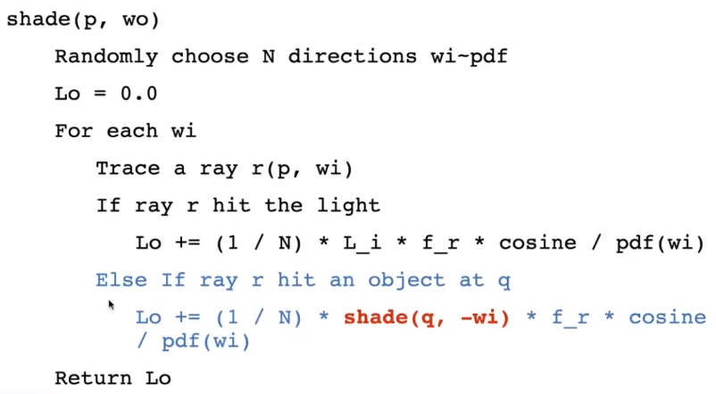

问题：1 光线数量爆炸，计算量过大

解决方法：使用一根光线进行计算

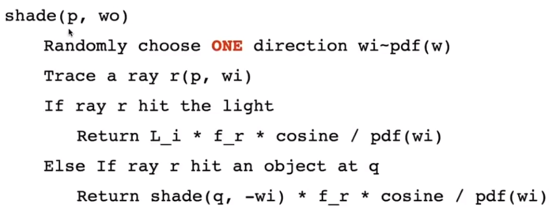

**一根光线照成的噪声如何避免？**

我们只要在一个像素上发出多根光线就可以了，每一次取随机的方向进行弹射即可。

**递归深度如何确认?**

我们使用"俄罗斯轮盘赌" 的方法来解决：

> 以一定的概率来停止这个递归过程
> 我们定义这个概率为P 
> 如果可以继续进行那么得到的结果Lo / P
> 如果不能进行返回0

最终数学期望为：E = P * (Lo / P)  + (1 - P) * 0 == Lo 

**如何采样**

我们之前采样假设PDF为一个常数 0 < k < 1

如果我们的光源特别小（采样光线很难达到光源）那么我们需要花费很多光线来检测这个光源

> 解决方法：我们在光源上进行采样。
> 但问题是我们的渲染方程是在被观测点上进行积分的(被测点的半球)，采样物体不同结果是错误的。
> -> 把渲染方程写成在光源上进行积分即可

如果要进行方程的转换：我们必须知道光源面积A和立体角之间的关系如图
也就是让A投影到这个立体角方向上

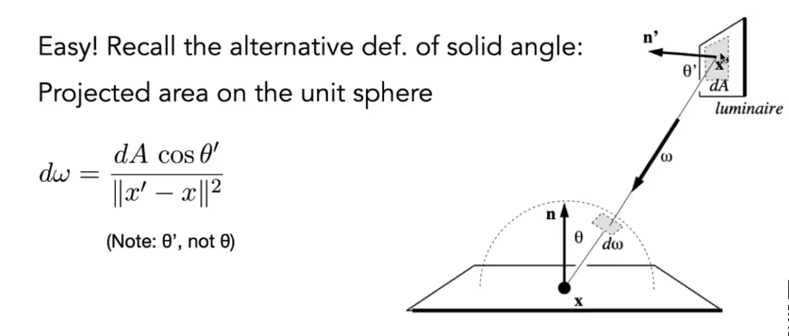

最后得到的方程:

这个式子意味着光源对这一点的贡献最大

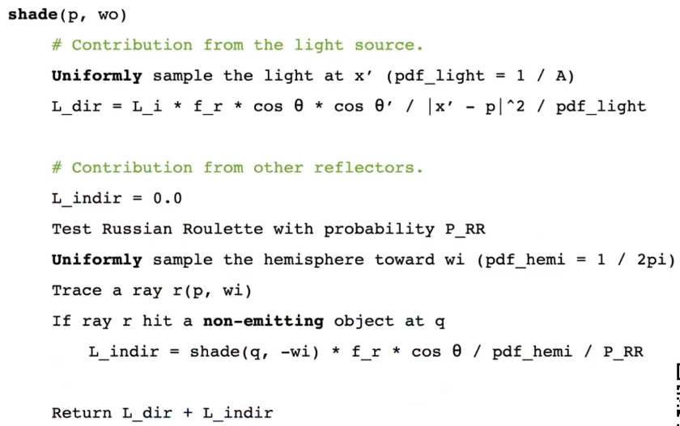

