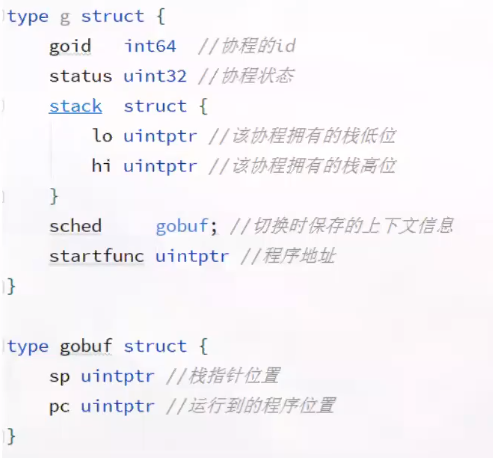
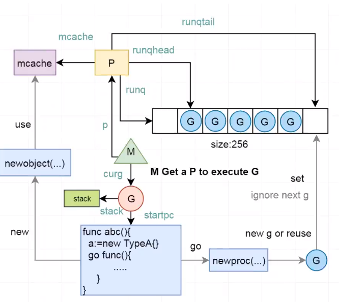
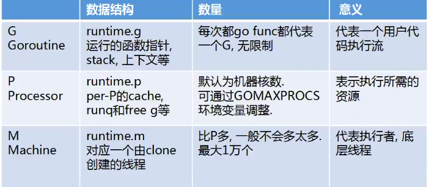
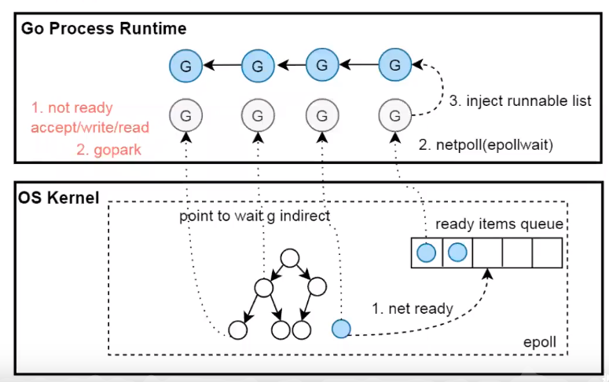

##go内存管理 gc原理 协程调度


https://zhuanlan.zhihu.com/p/91143269  go内存管理中译

https://zhuanlan.zhihu.com/p/95056679 万字长文，Golang Runtime

https://www.bilibili.com/video/BV1oE411y7qG 上面文章对应的视频

##协程结构体以及实现概念

**调度模型的发展是不断减少切换成本，不断共享的**




##GM模型








1. 每个线程都有一个本地缓存mcache
2. 每个P拥有自己的runq(运行队列)，新的G放入自己的runq中不需要再去调度全局的runq,满了之后在放入全局的runq中
3. 当p没有G执行时回去从全局或者其他P的队列里面拿出G执行(work steeling) 





1. 对于epoll的封装，所有网络fd都是以边沿模式，NONBLOCK模式挂到epoll节点中
2. 当一个G执行网络操作时，系统会将这个G封装成一个结构体，在OS内核的这个epoll红黑树上面会有一个指针指向这个G的结构体。
3. 当G进行网络操作(accept read write等)时，系统会立刻返回EAGAIN，并进行协程切换。然后这个操作会封装成一个data结点指向对应的g，


##非类型安全指针


1. 非类型安全的指针是指针，uintptr值是整数

   uintptr通常用来存储地址，但它并不会引用这个地址的内存，因此即便是有一个uintptr正在被使用，GC也会回收这块内存

   垃圾回收只有指针引用才不会被回收掉

2. GC的时机是难以确定的。可以手动调用runtime.GC启动GC。最大GC间隔为2分钟。

3. 有些内存地址会在运行时改变。Go中每个协程会维护一个本地栈，栈满了后runtime会开辟一段新的连续内存地址，并把原来内存移动到新的内存上。

4. 注意值的生命周期

   ```
   type T struct{x int; y [1024]byte}
   func bar(){
   	t := T{y:new([1<<23]byte)}
   	p := uintptr(unsafe.Pointer(&t.y[0]))
   	//这时y[0]，没有引用了，编译器可能会GC释放掉y[0]的内存
   	*(*byte)(unsafe.Pointer(p)) = 1// 危险操作
   	fmt.Println(t.x) //t.x可以继续使用
   }
   ```


###非类型安全指针使用


1. 将某一个类型\*T1指针转化为非类型安全指针，再转换为类型另外一个类型\*T2的指针


**类型T1的尺寸不能小于T2**

```go
func Float64Bits(f float64) *uint64{
    return *(*uint64)(unsafe.Pointer(&f))
}
func Float64FromBits(b uint64) float64{
    return *(*float64)(unsafe.Pointer(&b))
}
func ByteSlice2String(b []byte)string{
    return *(*string)(unsafe.Pointer(&b))
}
```


2. 将一个非类型安全指针转换成uintptr值，然后参与算术运算后再转化成非类型安全指针


规则：转换前后必须指向同一个内存块，两次转换必须再用个语句中。


```

ptr2 = unsafe.Pointer(uintptr(ptr1)+offset)

ptr2 = unsafe.Pointer(uintptr(ptr1) &^ 7)
```


```go
type T struct{x bool; y [3]int16}

const N = unsafe.Offsetof(T{}.y)
const M = unsafe.Sizeof(T{}.y[0])

func main(){
    t := T{y : [3]int16(123,456,789)}
    p := unsafe.Pointer(&t)
    ty2 := (*int16)(unsafe.Pointer(uintptr(p)+N+M+M))
    fmt.Ptrinln(*ty2)  // 789
}


```


