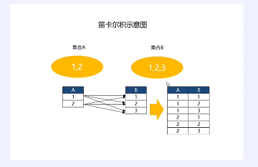

#SQL优化初探

##SQL关键字解释

###笛卡尔积

> 代数中，笛卡尔积叫做直积。表示为X × Y，第一个对象是X的成员而第二个对象是Y的所有可能有序对的其中一个成员。
>
> 假设集合A={a, b}，集合B={0, 1, 2}，则两个集合的笛卡尔积为{(a, 0), (a, 1), (a, 2), (b, 0), (b, 1), (b, 2)}。

###语句关键字

**FROM** <表名>: 会选取n个表 ，对这n个表进行笛卡尔积后输出成一个虚表。

**ON** <条件> : 对这个虚表进行筛选。

**JOIN** <join, left join, right join...>
<join表> ： 指定join，用于添加数据到on之后的虚表中，例如left join会将左表的剩余数据添加

**WHERE** <where条件> ： 对上述虚表进行筛选
**GROUP BY** <分组条件> ： 分组
<SUM()等聚合函数> # 用于having子句进行判断，在书写上这类聚合函数是写在having判断里面的
**HAVING** <分组筛选> ： 对分组后的结果进行聚合筛选
**SELECT** <返回数据列表> ： 返回的单列必须在group by子句中，聚合函数除外
**DISTINCT** ： 数据除重
**ORDER BY** <排序条件> : 排序
**LIMIT** <行数限制>

##索引命中

参考https://zhuanlan.zhihu.com/p/40820574

1. 最右匹配原则

等值的条件去命中索引最左边的一个字段，然后依次从左往右命中，范围的放在最后。

比如：当为表创建联合索引(a,b,c)时，只有a或ab或abc 这三种组合条件查询才能命中索引，像ac bc ba这样的查询是不能命中的。

2. 覆盖索引

当select的字段就是索引时，就不必要找到B+树的叶子节点，直接拿来用就可以了。

##聚集索引和非聚集索引

**聚集索引** ： 指一个字段是按照顺序排列的，比如 ` id int NOT NULL AUTO_INCREMENT  ... PRIMARY KEY (id)`   这句中，如果我们要寻找id==10的那一行，只需要讲开头指针偏移10行就能找到这时的时间复杂度为O(1)

**非聚集索引** ：假设一个字段`data INT NOT NULL,` 这句中 意味着data是无序的，那么我们要找到data==100的字段需要一次从头往后遍历，直到找到这个100，时间复杂度为O(n)，如果我们给这个字段增加索引，那么mysql内部会对这个字段生成一个B+树。我们如果要查询这个字段，只要去寻找这个B+树查询即可。

###索引构造

**normal index:**

CREATE INDEX <索引名> ON <表名>(列名1，列名2,...) 

ALTER TABLE <表名> ADD INDEX <索引名>(列名1，列名2,...);

CREATE TABLE 表名 ( [...], INDEX 索引名 (列名1，列名 2,...) );

**unique index:**

能够保证字段值唯一不变的(比如身份证) 可以在index前加上unique

CREATE  UNIQUE INDEX <索引名> ON <表名>(列的列表);

**如何选择：**

> 较频繁的作为查询条件的字段应该创建索引
>
> 重复太多的字段不适合单独创建索引，即使频繁作为查询条件
>
> 不会出现在WHERE子句中的字段不应该创建索引
>
> 表的记录比较少，比如只有几百，一千条记录，那么没必要建立索引
>
> 不重复的字段越多，那么索引的价值越高

##优化策略

###查询优化

1. 避免开头模糊查询比如 like "%aaa%"
2. 避免使用in和not in 如 WHERE id IN (2,3) 替代方案：select * from A where exists (select * from B where B.id = A.id);
3. 避免使用or 替代方案：UNION
4. where条件不要出现计算
5. where复合条件要有复合索引并且能够依次命中 如 where key_part2=1 and key_part3=2中必须要有联合索引：index(key_part2,key_part3)
6.  order by 条件要与where中的一致：如 where age > 0 order by age
7. 不要使用 * 根据业务使用字段名代替 *
8. 多表关联查询时，小表在前，大表在后。
9. 用where字句替换HAVING字句

###条件优化

**group by优化**：

默认情况下mysql会对group by的字段排序，如果你不想要这个优化可以指定 order by null 如 GROUP BY col1, col2 ORDER BY NULL ;

**拆分复杂SQL为多个小SQL，避免大事务**

简单的SQL容易使用到MySQL的QUERY CACHE

减少锁表时间特别是使用MyISAM存储引擎的表

可以使用多核CPU

**join**

我们通常使用临时表来进行条件筛选比如：

`SELECT col1 FROM customerinfo WHERE CustomerID NOT in (SELECT CustomerID FROM salesinfo )`

这样能够避免死锁等。

如果使用连接(JOIN).. 来完成这个查询工作，速度将会有所提升

`SELECT col1 FROM customerinfo `
`   LEFT JOIN salesinfoON customerinfo.CustomerID=salesinfo.CustomerID `
`      WHERE salesinfo.CustomerID IS NULL `

**尽量使用union all 代替union**

**使用truncate代替delete**

###建表优化

**根据可能的where 和group by 来建立索引**

**尽量使用数字而非字符串**

**用varchar/nvarchar 代替 char/nchar ** 因为首先变长字段存储空间小，可以节省存储空间，其次对于查询来说，在一个相对较小的字段内搜索效率显然要高些

